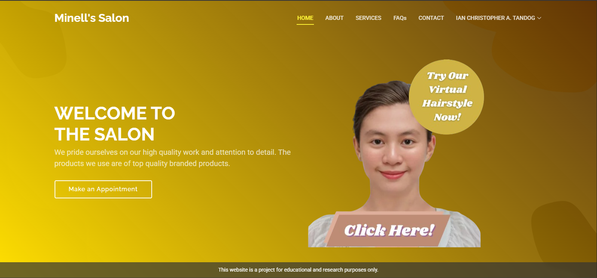
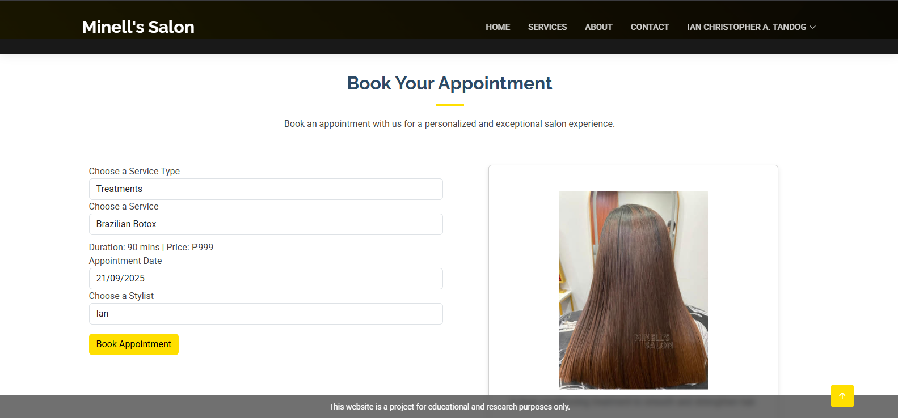
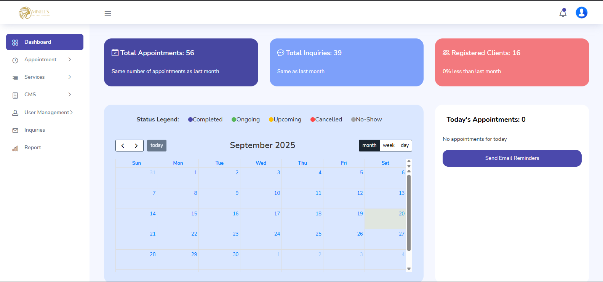

📌 Featured Project: Web-Based Appointment System with Chatbase Integration

Role: Full Stack Developer
Client: Beauty Salon (Minell’s Hair, Nail, and Lashes Salon)

A full-stack web application designed to modernize salon operations by streamlining appointment scheduling, client inquiries, and admin management. The system improves operational efficiency while enhancing the customer experience.

## 📸 Screenshots
  
  
 

🎯 Objectives

Provide clients with an easy-to-use appointment scheduling system.

Enable customers to inquire about services, availability, and promotions directly through the site.

Allow administrators to manage appointments, inquiries, reports, and salon information in one platform.

🚀 Features
👩‍💻 Client-Side

Homepage showcasing salon branding, services, gallery, and promotions.

User authentication (registration, login/logout, password recovery).

Profile management (update personal details, view/edit appointments).

Book appointment (choose services, stylists, available slots, and pricing).

Virtual Hairstyles – preview hairstyles, colors, and treatments online.

Inquiry & Contact system with social media integration.

🛠️ Admin-Side

Dashboard with insights into appointments, inquiries, and customer interactions.

User management with role-based access (admin, stylist, client).

Appointment monitoring with integrated calendar view.

Content management for services, pricing, and promotions.

Availability time scheduling to block off special dates/holidays.

Report generation for appointments, staff performance, and usage statistics.

💬 Integration

Chatbase.co integration for automated responses to client inquiries.

Responsive design optimized for both desktop and mobile devices.

Secure login system with session handling and validation.

🔐 Admin Test Account

Email: minells.salon@gmail.com

Password: admin

⚠️ Note: This account is for demo/testing purposes only.

📌 Scope

This project covers the development, deployment, and initial operation of the salon’s appointment system, including both front-end (customer-facing) and back-end (admin-facing) modules.

⚠️ Limitations

❌ Does not support online payment transactions.

🛠️ Tech Stack

Frontend: HTML, CSS, JavaScript, Bootstrap

Backend: PHP, MySQL

Integration: Chatbase.co

Version Control: Git